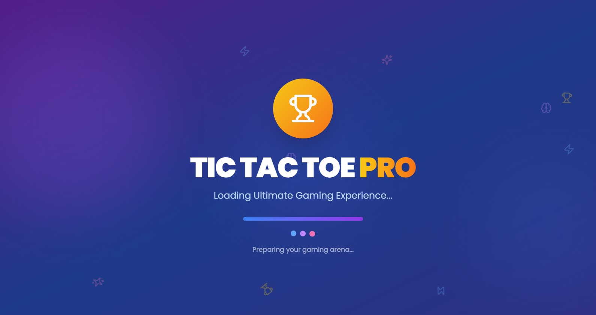
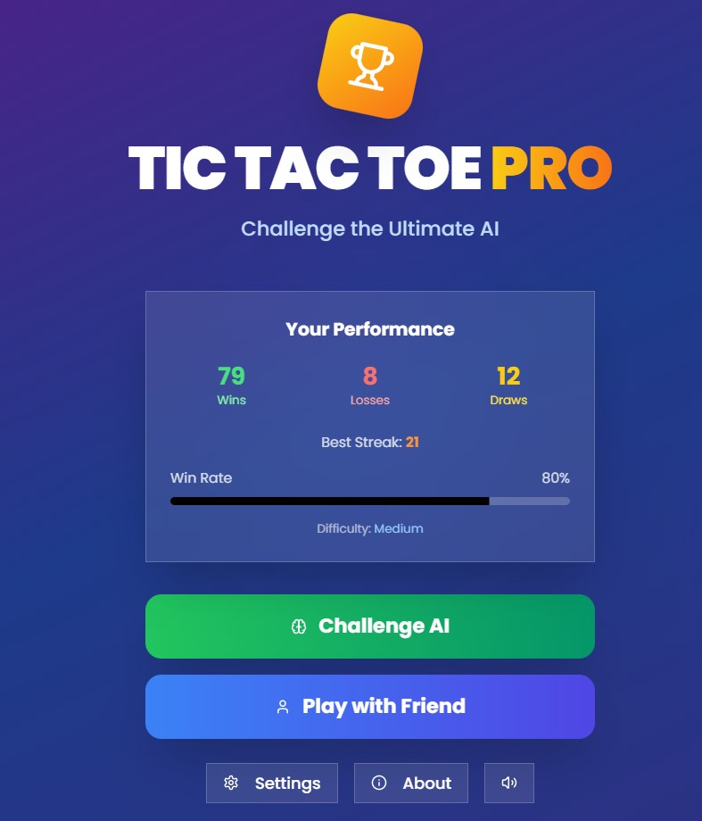
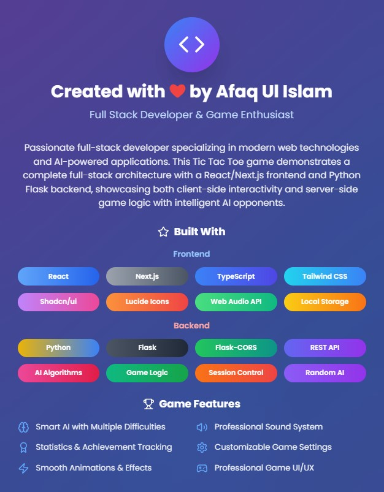
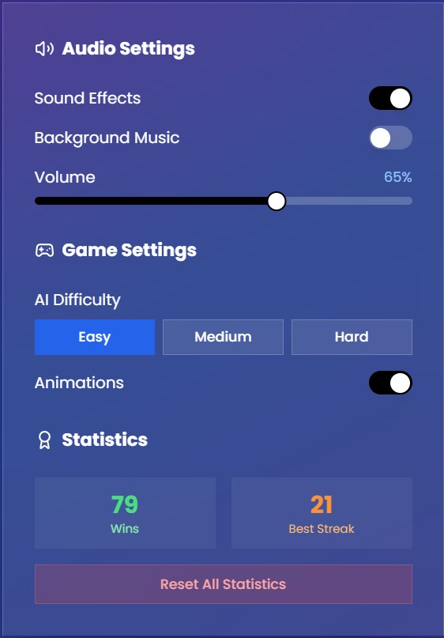

# Tic Tac Toe Pro - Ultimate Gaming Experience



A modern, feature-rich implementation of the classic Tic Tac Toe game. Includes intelligent AI opponents (with Minimax), local multiplayer mode, beautiful UI/UX design, and detailed performance tracking — delivering a smooth and premium gaming experience powered by Next.js and Python Flask.

---

## ✨ Table of Contents

- [Features](#features)
- [Technologies Used](#technologies-used)
- [Installation](#installation)
- [How to Play](#how-to-play)
- [Game Modes](#game-modes)
- [Screenshots](#screenshots)
- [Contributing](#contributing)
- [License](#license)
- [Contact](#contact)

---

## ✨ Features

### 🎮 Gameplay

- ✨ AI Opponent with three difficulty levels (Easy, Medium, Hard)
- ✨ Local Multiplayer mode for two players
- ✨ Smooth animations for moves, victories, and draws
- ✨ Integrated sound system for immersive feedback
- ✨ Fully responsive design for all devices

### 📊 Statistics & Achievements

- ✔ Win, Loss, and Draw tracking
- ✔ Win streaks and best performance stats
- ✔ Win percentage and total games
- ✔ Achievements and badges based on performance

### ⚙️ Customization

- ▶ Change AI difficulty levels
- ▶ Toggle sound effects and background music
- ▶ Control volume level
- ▶ Enable or disable animations

### 🌟 Additional Highlights

- Beautiful loading animations
- Victory celebrations and result pop-ups
- Gradient backgrounds and polished UI
- Dark-mode optimized theme
- Saves game stats and preferences using localStorage

---

## 💻 Technologies Used

### Frontend

- **React** - Modern UI Library
- **Next.js** - Full-stack React Framework
- **TypeScript** - Static typing for JavaScript
- **Tailwind CSS** - Utility-first styling
- **Shadcn/ui** - Component library
- **Lucide Icons** - Icon set
- **Web Audio API** - Sound system

### Backend

- **Python** - Core programming language
- **Flask** - Lightweight web framework
- **Flask-CORS** - CORS handling for cross-origin requests
- **REST API** - Interface between frontend and backend
- **Minimax Algorithm** - Unbeatable AI logic

### Deployment

- **Vercel** - Frontend hosting
- **Render** - Backend hosting

---

## ⭐ Installation

### 1. Clone the repository

```bash
git clone https://github.com/afaqulislam/aui-tictactoe-pro.git
```

### 2. Install Frontend Dependencies

```bash
cd aui-tictactoe-pro/frontend
npm install
```

### 3. Install Backend Dependencies

```bash
cd ../backend
pip install -r requirements.txt
```

### 4. Start Development Servers

```bash
# Frontend
cd frontend
npm run dev

# Backend
cd backend
python app.py
```

Visit: `http://localhost:3000`

---

## 🎮 How to Play

1. Choose a game mode: Play against AI or Human.
2. Take turns marking a square in the 3x3 grid.
3. The first to align 3 marks horizontally, vertically, or diagonally wins.
4. If all squares are filled and no winner, it’s a draw!

---

## 🕹️ Game Modes

### 🤖 Challenge AI

- **Easy**: Random move selection
- **Medium**: Strategy-based decisions
- **Hard**: Uses Minimax algorithm (nearly unbeatable)

### 👥 Play with Friend

- Local multiplayer on the same device
- Turn-based play for Player X and Player O
- Ideal for friendly competitions

---

## 📸 Screenshots

| Main Menu                           | About                        | Settings                           |
| ----------------------------------- | ---------------------------- | ---------------------------------- |
|  |  |  |

---

## 📚 Contributing

Contributions are always welcome! Follow these steps:

1. Fork the repo
2. Create a branch: `git checkout -b feature/your-feature`
3. Commit changes: `git commit -m 'Add feature'`
4. Push to GitHub: `git push origin feature/your-feature`
5. Submit a pull request

---

## 📄 License

This project is licensed under the **MIT License**. See the [LICENSE](LICENSE) file for details.

---

## 💬 Contact

**Created by Afaq Ul Islam**

- [GitHub](https://github.com/afaqulislam)
- [LinkedIn](https://www.linkedin.com/in/afaqulislam)
- [Portfolio](https://aui-portfolio.vercel.app)
- [Email](afaqulislam707@gmail.com)

Feel free to reach out for questions, feedback, or collaborations!

---

> Made with ❤️ by Afaq Ul Islam - Let's build something amazing together!
